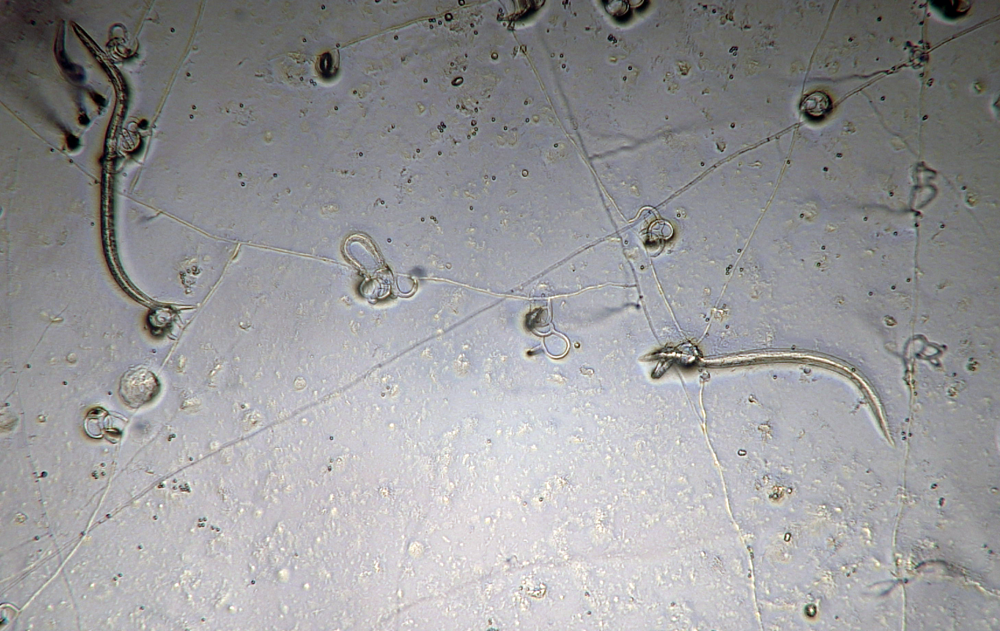

[{#fig-nema1 style="display: inline-block;" }](https://pnwhandbooks.org/plantdisease/pathogen-articles/common/nematodes)

Further reading:  
 - [Cereal Cyst Nematodes: Biology and Management in Pacific Northwest Wheat, Barley, and Oat Crops 
](https://extension.oregonstate.edu/catalog/pub/pnw-620-cereal-cyst-nematodes)