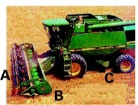

*Image: J Piaskowski*

## Summary

This chapter emphasizes that maximizing wheat yield and quality requires careful harvest timing, precise combine adjustment, and attentive storage management. Harvest should occur before shattering from dry weather or sprouting from rain, with grain at or below 12–12.5% moisture for safe storage; wetter grain, especially seed wheat, must be dried promptly at temperatures below 110°F.  

Combine settings for cylinder speed, concave clearance, fan speed, reel speed, and ground speed should be fine-tuned in the field to minimize losses from shattering, header inefficiency, leakage, and poor separation, while managing heavy straw to avoid plugging and traction hazards. Loss-measurement techniques help diagnose issues, and specialized headers or reels can improve efficiency in lodged crops. In storage, grain should be kept dry, cool (ideally below 50°F), and insect-free, with clean bins, regular inspections, and aeration to prevent heat and moisture migration that can cause spoilage, ensuring that field grains are preserved until the wheat leaves storage.

## Harvesting

Proper adjustment and operation of the combine reduces harvest losses. Adjust the combine initially to specifications provided by the manufacturer and field check for grain loss out of the back of the combine. Depending on variety, approximately 16 to 20 kernels per square foot on the ground represents a one bushel per acre loss. Adjust air speed to separate chaff from grain without blowing grain out the back of the combine. On cylinder-type combines, adjust cylinder speed and concave clearance to thresh grain free without cracking. Periodic field checks should be made during harvest to adjust for changing moisture content of the straw and grain.  

Wheat yield and volume of wheat straw is highly variable depending on production system and growing environment. High-yielding spring wheat varieties under irrigation can produce as much or more straw as high-yielding dryland winter wheat, or as much as 5-7 tons of straw per acre. The key to efficient harvest is controlling the amount of material entering the cylinder for best grain separation and to avoid plugging.  

::: {.callout-tip}
## Harvest Safety Tip

Heavy straw residue can reduce equipment traction, especially on slopes. Operators should identify areas where footing or control may be compromised and adjust their approach to maintain safe working conditions for themselves and the entire harvest crew.  
:::

Management of a wheat crop for optimum health and production potential must continue through harvest. There are several factors to consider both during and after wheat harvest.  

## Moisture Content

Moisture content is critical in preventing preharvest and postharvest losses. To minimize preharvest losses, winter wheat must be harvested before wind causes shattering under dry conditions or rain causes sprouting in the head. The grain must be dry enough for safe storage, preferably less than 12 to 12.5 percent moisture by weight. If moisture content is higher than this, the grain must be dried prior to storage. The general recommendation is to thresh at moistures not greater than 20 percent and to dry with air not exceeding 110°F (43°C), especially if the wheat is to be used for seed, since higher temperatures can damage germination.  

## Combine Settings

Combines must be properly adjusted to minimize combine harvest losses and to avoid cracking the grain, which invites greater damage from storage molds and insects. Grain left on the ground, either because of shattering or improper combine adjustments, represents grain that cannot be sold, as well as a source of future volunteer plants to host diseases and insects. Straw and chaff must be spread as uniformly as possible to reduce problems in planting and performance of the following crop (see @sec-management-considerations-for-conservation-tillage-systems: Management considerations for conservation tillage systems). 

## Minimizing Losses from Shattering and Sprouting

The first step in minimizing losses from shattering and sprout damage is to choose the appropriate variety of wheat for your area. Harvesting at the ideal time and moisture content can reduce shattering and sprouting, but this is often beyond the grower’s control. Wheat can be harvested at a moisture content higher than what is recommended, but this grain will have to be dried before or immediately after it is placed in the bin.  

A second option for dealing with wet wheat is swathing and allowing it to dry in windrows on the stubble. Once the grain has reached the maximum-weight phase of grain fill (see @sec-growth-development: Growth and development), the wheat can be swathed with no loss of yield. The grain is at physiological maturity by this stage, but the plant is still alive and has considerable moisture in the straw as well as in the grain. Swathing speeds the drying process for the plant and grain.    

## Minimizing Cracking and Combine Losses 

Final combine adjustments to minimize cracking and combine losses must be made in the field, several times each day and in each new field. The tendency for kernels to crack or thresh out varies by day and even by time of day, depending on the moisture content of the grain and straw. Threshability of the grain also varies by wheat variety and by weed population. Late-season green weeds may require swathing or a preharvest burndown herbicide.  

Critical adjustments on the combine include cylinder speed, fan speed, reel speed, and ground speed. The cylinder speed and concave clearance should thresh but not crack the grain. The fan speed should be adjusted to blow out chaff but not grain. Avoid header losses (broken heads) by setting the reel speed and cutting height to leave as much standing stubble as possible. Adjust ground speed to set the rate of straw feed to the straw walkers to optimize harvest efficiency. Initial adjustments should be made as close to the manufacturer’s operator manual as possible, but final adjustments should be based on the actual field performance of the combine.  

Growers can accurately measure and monitor combine losses, including shattering, header losses, leakage from the combine, and losses out the rear of the combine, by following a few simple steps. With the straw spreader disengaged, harvest a short strip of typical grain, then stop and let the combine clean out. Mark the rear of the header (position B in @fig-combine-16-1) and in front of the rear wheels of the combine (position C in  @fig-combine-16-1), then back the combine to expose this strip. The actual losses and reason for these losses can be estimated by the location and the amount of grain on the ground.  

{#fig-combine-16-1}

### Steps to Distinguish Header Losses from Shattering 

1. Identify Two Locations:  
  + **Position A:**  Standing grain — used to measure *shatter loss only*.  
  + **Position B:**  Recently harvested grain — used to measure *shatter loss plus header loss*.  

2. Mark Sampling Areas:  
  + At each position, mark **at least five** one-foot-square areas.  
  + Ensure the sampling areas at Position B are uniformly spaced across the header swath. 

3. Collect Data at Each Area:   
  + Count the number of loose kernels on the ground.  
  + Count the number of broken heads on the ground.  

4. Calculate Averages:  
  + For each position (A and B), calculate the **average number of kernels and broken heads** per square foot.  

5. Determine Header Loss:  
  + Subtract the average values at **Position A** (shatter loss) from the average values at **Position B** (total loss).  
  + The difference represents the header loss.  
  
  
| Average Kernel Weight | 1 bu/ac equivalent |  
|:---------------------:|:------------------:|  
| (mg)                  | (kernels/sqft)     |  
| 25                    | 25                 |  
| 30                    | 20                 |  
| >40                   | 15                 |  
  
: Kernel weights and concentration to estimate 1 bushel per acre harvest loss. {#tbl-kernel-wts}  
  
Header losses usually indicate that either the reel is revolving too slowly or too fast, or it is too high or low above the cutter bar. The reel should be eight to twelve inches in front of the cutter bar and should turn about 25 percent faster than the ground speed of the combine. For wheat that has lodged, a pick-up reel will minimize header losses. Stripper headers have been shown to be particularly effective in harvesting lodged grain. Both stripper headers and air reels generally reduce grain losses and improve harvest efficiency compared to the traditional reels. For more information on stripper headers in use on dryland grain farms, see [STRIPPER HEADER AND DIRECT SEEDING: RON AND ANDY JURIS Farmer-to-Farmer Case Study Series: Increasing Resilience among Cereal-Based Farmers in the Inland Pacific Northwest](https://wpcdn.web.wsu.edu/wp-ecommerce/uploads/sites/2/product-4199-sku-PNW694.pdf).  

Growers can evaluate combine leakage by examining the grain on the ground between position B and C. The previous estimates of losses from shattering and damage from the header will indicate kernels already lost before the grain went into the combine. Concentrations of kernels in small areas indicate major leaks from the machine.  

Improper fan speed adjustment may be responsible for grain loss. Kernels on the ground behind the combine may indicate that too much air is preventing the grain from settling through the chaffer (also called upper sieve) and sieve. Too little air can cause the chaffer to clog with chaff and straw so the grain cannot settle out. Losses from the rear of the combine can also indicate that there is too much straw for proper separation. Unthreshed heads in the straw behind the combine may indicate that the cylinder speed and/or concave setting should be adjusted for better threshing, or that the grain is not ripe and is too wet to harvest.  

Some varieties are more difficult to thresh cleanly. Growers should regularly check for unthreshed heads and white-caps (pieces of heads where the glumes did not separate from the grain kernel) and make needed adjustments to improve grain cleanliness and combine efficiency. Environmental conditions during grain development and maturation will also influence ease of threshing.  

## Storage Management

The benefits of managing for optimal health and productivity of the wheat crop and harvesting with the highest possible efficiency can be lost if the grain deteriorates in storage because of molds or insects. Management of the grain must continue until the wheat is removed from storage.  

Improperly stored grain can negatively affect the downstream grain market. Millers often reject grain containing live insects and may enforce strict limits on insect fragments and insect-damaged kernels. Additionally, much of Idaho’s grain is exported and international buyers often have their own quality standards. The management of on-farm grain storage should focus on minimizing penalties at the time of sale, and meeting the quality requirements set by end users.  

The hazards to grain during storage, including molds, insects, loss of weight, and chemical changes, are all related directly or indirectly to higher moisture or temperature of the grain. Grain deterioration in storage can be minimized or prevented altogether by keeping the grain dry, cool, and free from insects. Grain moisture content should be 12 percent or less. Air should be below 50°F, and preferably lower. Every effort should be made to eliminate all sources of grain-storage insects from old grain left in the bin or grain auger or other sources. Even a few insects harbored in the bin or introduced with the grain can lead to a serious infestation over time, given the right conditions.  

Preventative Measures:  

* Clean all grain trucks and harvesting equipment thoroughly before harvest begins.  
*	Sanitize and prepare storage bins prior to filling.  
*	Remove weeds and clean up any spilled grain around storage bins to reduce pest pressure.  
*	Store grain at proper moisture level <12%.  
*	Avoid storing newly harvested grain on top of older grain.  
*	Consider applying an insect control agent to stored grain to prevent infestation such as insect growth regulators (IGRs), diatomaceoues earth or other EPA approved insecticides.  
  
  
| Active Ingredient | Usage / Notes |
|:------------------|:--------------|
| Cyfluthrin / Beta-cyfluthrin	| Residual empty-bin surface insecticide |  
| Deltamethrin | Residual empty-bin surface insecticide |  
| Diatomaceous earth (labeled for grain) | Empty bin treatment |  
| Phosphine	| Fumigant; restricted use; label-required monitoring |  

: Insecticides labeled as empty bin treatments {#tbl-empty-bin}  
  
  
  
| Active Ingredient | Usage / Notes |
|:-------------------|:--------------|
| Methoprene        | IGR; controls immature stages only |  
| Pyriproxyfen      | IGR; long residual control |  
| Spinosad          | Reduced-risk grain protectant |  
| Pyrethrins + PBO  | Short residual; knockdown |  
| Diatomaceous earth (labeled for grain) | Applied to top/bottom of grain to reduce test weight loss |  

: Insecticides labeled for use as grain protectants {#tbl-grain-protect}  
  
  
Monitoring:  

Bins should be checked for insects and mold at least every two to three weeks, and more frequently during periods of large temperature fluctuations.  

A monitoring protocol is one of the most effective tools for preventing storage losses. Grain should be checked for pests at least monthly throughout the winter, and weekly or bi‑weekly during late summer and fall before outdoor temperatures drop. A rapid increase in grain temperature may indicate a developing pest or moisture problem.  

Grain pitfall probe traps are an effective way to monitor insect activity in stored grain. When checked regularly, these traps help detect changes in insect populations and can aid in identifying the insect species.  

Grain temperature probes are another valuable tool for monitoring grain quality and detecting insect‑damaged kernels.  

In addition to these tools, managers should routinely check storage areas for any unusual odors that could indicate spoilage or infestation. Consistent monitoring is an important post‑harvest practice and plays a key role in mitigating storage losses.  

Aeration and dryers:  

It is almost impossible to have a bin of grain with uniform moisture content. When outdoor temperatures drop in the fall and winter, the grain near the bin wall cools, resulting in downward airflow near the exterior of the bin. Meanwhile, the insulated grain in the center of the bin stays warm creating upward flow toward the top center of the bin. This circulation pattern can lead to areas of concentrated heat and moisture, leading to grain crusting and favorable conditions for insects and fungal contamination. Left alone, heat and moisture will rise and concentrate near the top of the bin creating a potential favorable environment for insects and fungal contamination, causing grain spoilage. Consequently, aeration is the safest way to reduce both grain moisture in the bin and to reduce grain temperature.  

For additional information on grain storage, see [University of Idaho CIS 518 Maintaining Stored Grain Quality](https://www.lib.uidaho.edu/digital/uiext/items/uiext28989.html).  

