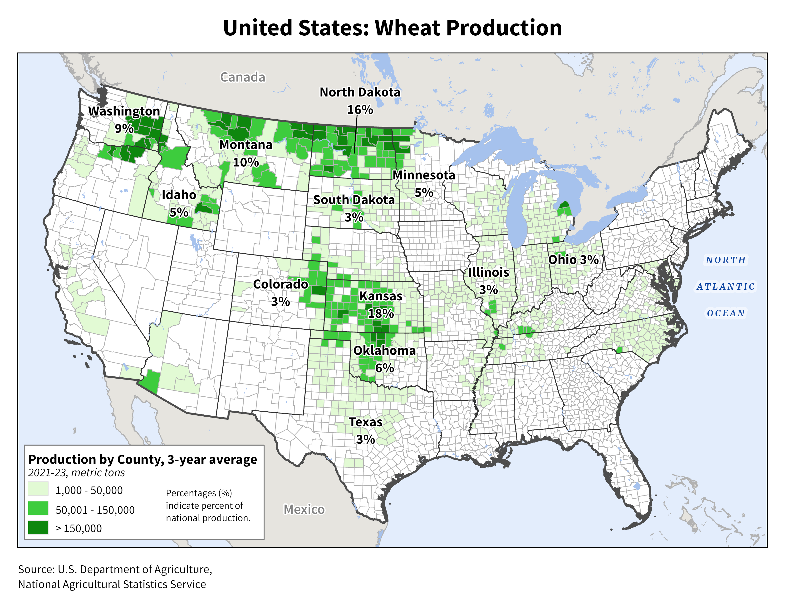

### Introduction

The unique quality characteristics of wheat protein lends itself as essential to the production of leavened breads, while other classes of wheat are used in various products such as cookies, pastries, noodles, cakes and pancakes [@johnson1987].

#### Origin of wheat and environmental adaptation

Wheat and other cereal grains were instrumental in the evolution of human societies [@cropsa1992]. Several of the earliest known civilizations in the Near East’s fertile crescent co-evolved with modern wheat. From the first collection and cultivation of cereals to modern production, wheat has been used predominantly as a source of food and less for feed and forage. Worldwide cultivation reflects both the capacity for environmental adaptation and the reliance of humans on wheat as a critical food source. Currently 20% of the world population’s caloric and protein intake is based on wheat [@erenstein2022], with sustainable methods of production supporting both food and economic stability.

![World wheat production potential [@halecki2022].](figs/1-1-global-wheat-production.png){#fig-global style="display: inline-block;" }  

#### US wheat cultivation

Various regions in the US specialize in production of different classes of wheat. Generally, regions specialize in the production of one or two of the main market classes: soft red winter wheat, hard red winter wheat, hard red spring wheat, hard white, soft white wheat (including club wheats), and durum. The Central Plains states produce high protein wheat for bread markets while lower protein soft red wheat is produced in the eastern and southern regions east of the Mississippi. Development of production systems depends on the market, the environment, the length of the growing season and the dominant crop rotation. Unique to the PNW, five market classes are produced across the region, requiring different production practices and specialized grain handling.

{#fig-us-wheat style="display: inline-block;" }

## Idaho Wheat Quick Facts

#### Statewide wheat production in Idaho, 2024 {#tbl-idprod}

| Habit | Harvested Area (acres) | Yield (bu/A) | Production (bu)^[60 lb = 1 bu] |
|------------------|:----------------:|:----------------:|:----------------:|
| Winter wheat | 700,000 | 89 | 62,300,000 |
| Spring wheat | 435,000 | 89 | 38,715,000 |
*Source: [USDA National Agricultural Statistics Service](https://www.nass.usda.gov/Statistics_by_State/Idaho/index.php)* 

 
  
### Southern Idaho Wheat Factsheets

::: {.grid}

::: {.g-col-6}





<!--- 
- [Soft White Spring Wheat](listings/quick_facts/979_2024_sws.pdf)\
- [Hard Spring Wheat](listings/quick_facts/986_2024_hsw.pdf)\ -->

:::

::: {.g-col-6}





<!--- 
- [Soft White Winter Wheat](listings/quick_facts/984_2024_sww.pdf)\
- [Hard Winter Wheat](listings/quick_facts/980_2024_hww.pdf) -->
:::

:::

