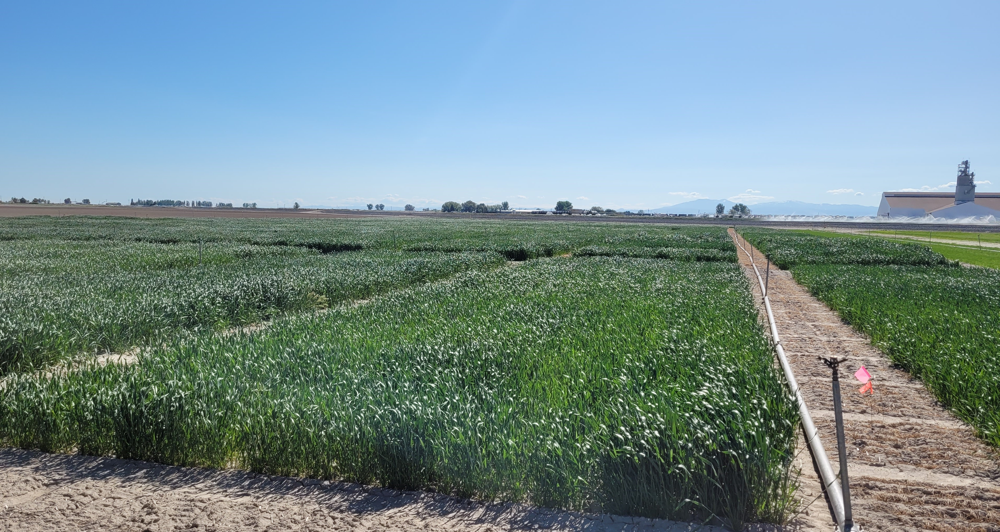

{.img-wpg}  
<!---->
*Image: J Piaskowski*


## Key attributes for Idaho production conditions

Idaho’s wheat production contributes significantly to both domestic and international wheat markets. Nationally, Idaho ranks among the top eight states for wheat and wheat-product exports, with approximately 50% of the wheat grain production destined for the export market.  

Improved grain yield and end-use quality are the two most vital traits required for new wheat cultivars. To maintain the competitiveness of Idaho wheat growers and support the market demand for Idaho wheat, it is essential to continuously increase the crop’s productivity by developing wheat varieties with high yield, premier quality, and resistance or tolerance to major biotic and abiotic stresses.  

Southeast Idaho has a unique irrigation infrastructure. In this area, stripe rust, Fusarium head blight, and bacteria leaf blight are major concerns in irrigated production, while nematodes, cereal leaf beetle, wheat stem saw fly, wireworm, dwarf bunt and snow mold are major problems in dryland production.  

Wheat in Northern Idaho is grown in a rainfed environment resulting in different diseases and pests. Biotic stresses include stripe rust, take-all, eyespot (strawbreaker foot rot), snow mold, barley yellow dwarf, wheat streak mosaic virus (WSMV), soilborne wheat mosaic virus (SBWMV), wireworms, aphids, cereal leaf beetle, Hessian fly, grasshoppers, and nematodes. Abiotic stresses include drought and heat, aluminum toxicity, and winter cold injury.  


## Wheat Cultivar Development at the University of Idaho

The University of Idaho has two breeding programs:  one located on Moscow campus in the Northern panhandle of the state, and another located in Aberdeen Research & Extension Center in Southeast Idaho. The northern program focuses on the soft white winter wheat development in partnership with Limagrain Cereal Seeds (LCS). The southern program focuses on spring wheat development in three market classes:  soft white spring, hard white spring, and hard red spring. Released cultivars from both breeding programs are included in Table 4.1 below.


```{r}
#| label: tbl-ui-cultivar
#| include: true
#| output: true
#| echo: false
#| tbl-cap: 'Spring and winter wheat cultivars released by University of Idaho currently in production.'  


files <- list.files(here::here("data"), pattern = "^tbl_4_1")

tbl_4_1 <- read.csv(file = here::here(
  "data", files), na.strings = "") |> 
  purrr::set_names(
    nm = c("Variety", "Class", "Release Type", "Year", "PI/PVP", 
           "PVP Date", "Intellectual Property")) |> 
  dplyr::arrange(Class, desc(Year), Variety) |> 
  dplyr::select(-`PVP Date`)


DT::datatable(tbl_4_1, 
              rownames = FALSE, 
              filter = "none")
```


### Conventional Wheat Breeding

Conventional wheat breeding is the primary method being used in the two breeding programs. It follows four major stages (click to expand each stage below and learn more):  

::: {.wpg title="1. Creation of Genetic Variation" collapse="true" icon="false"}

The goal is to **break the existing genetic balance** of parent plants and generate new genetic combinations with potential target traits.  

  -	**Methods:**  Use sexual hybridization (the most common method) - select two parent varieties or lines with complementary advantages, manually transfer pollen from the male parent to the female parent’s stigma to produce hybrid seeds (F1 generation).  

  - **Key purpose:**  Avoid "genetic homogeneity" of existing varieties; lay the material foundation for subsequent trait screening (no new variation = no better varieties to select).  

:::

::: {.wpg title="2. Inbreeding (Stabilizing Genetic Traits)" collapse="true" icon="false"}

The goal is to **inbreed the genetic material of hybrid offspring** to make target traits stable and fixed (instead of target traits changing generation by generation).  

  - **Methods:** Plant F1 hybrid seeds to harvest F2 generation seed (traits first show large segregation); continuously self-pollinate offspring (F2→F3→F4..) for 3 to 4 generations and select individual plants with desired combinations of target traits (e.g., both high-yield and disease-resistant) in each generation.  

  - **Key purpose:** Eliminate heterozygous plants to ensure that the selected plants/traits can be passed stably to the next generation, forming "pure line" materials.  

:::

::: {.wpg title="3. Line Evaluation (Testing Trait Practicality)" collapse="true" icon="false"}

The goal is to **verify that the stable pure lines meet the actual production needs** (not just "good in the test field").  

  - **Methods:** Conduct multi-location, multi-year field trials — plant the pure lines in different regions and under different environmental conditions; evaluate key traits (yield, disease resistance, adaptability, quality, etc.) and compare them with local adapted varieties currently used in the local commercial grain production.  

  - **Key purpose:** Select lines with multiple traits favorable in multiple environments.  
  
:::

::: {.wpg title="4. Variety Release (Promoting to Actual Production)" collapse="true" icon="false"}

The goal is to **obtain official recognition and realize large-scale production** of an excellent line.  

  - **Methods:**  
    1. Test the lines in the regional trials and state-wide variety trials in multiple environments and multiple states.  
    2. After strict review, including yield, quality, resistance to biotic and abiotic stresses, obtain the "variety approval certificate" from the university’s variety release committee.  
    3. Provide genetically pure and stable Breeder seed to the university’s Foundation Seed Program for multiplication of high-quality, physically pure Foundation class seed, the first step in the seed certification process.  
    4. Simultaneously continue testing in regional, state, and larger pre-commercial grower trials to verify adaptability across a wider geography under various production practices.  
    5. Ensure availability of seed to commercial grain producers through collaborative marketing efforts between seed producers/dealers, the breeding programs, and the university’s Office of Technology Transfer.  
    6. Promote the approved variety to seed dealers and farmers through technical training and demonstration fields.  
  
  - **Key purpose:** Turn "laboratory/greenhouse results" into "agricultural production products"--let the new variety officially replace old varieties and create economic benefits.  

:::

#### Advantages of Traditional Breeding Methods in Relation to Gene Editing

 -	**Lower cost and complexity:** Conventional breeding is generally less expensive and requires less technical expertise compared to gene editing, as it relies on well-established techniques like crossing and selection.  

 -	**Utilizes existing genetic resources:** Conventional breeding works by selecting and combining existing genetic material naturally found within the species, making it a more traditional approach to increasing genetic resources for crop improvement.  

 - **Improve Complex Traits:** For traits controlled by many genes (quantitative traits), conventional breeding is the most effective way to combine these complex genetic characteristics.  

 - **Public and Regulatory Acceptance:** Conventional breeding methods are widely accepted by the public and are not subject to the same strict regulations and labeling requirements as genetically modified (GM) crops in many regions (e.g., the EU). This facilitates market entry and the variety’s adoption.  


#### Limitations of conventional breeding

 - **Time-consuming:** The process of crossing and selection for desirable traits can take many generations, making it a slow method of crop improvement.  

 - **Less precise:** It lacks the precision of gene editing, which can be used to make specific, targeted changes without moving the entire genome. Instead, it relies on random recombination of genes during sexual reproduction, which can be less predictable.  

 - **Difficulty with novel traits:** It can be challenging or impossible to introduce novel traits that do not exist within the species' natural genetic pool.  


```{r}
#| label: tbl-ui-breeding
#| output: asis
#| echo: false
#| tbl-cap: 'Conventional Breeding Procedure Being Conducted in the University of Idaho'

files2 <- list.files(here::here("data"), pattern = "^tbl_4_2")

tbl_4_2 <- read.csv(file = here::here(
  "data", files2), na.strings = "") |> 
  dplyr::rename(`No. of Lines` = `No..of.lines`) |>  
  dplyr::mutate(across(everything(), \(x) tidyr::replace_na(x, "")))

knitr::kable(tbl_4_2, 
             row.names = FALSE,
             align = "lclll", longtable = TRUE)
```

### New Breeding Technologies

#### 1. CRISPR/Cas-mediated gene editing  

CRISPR/Cas-mediated gene editing is revolutionizing wheat breeding by providing a faster, more precise, and efficient way to address emerging production concerns. Gene editing has accelerated the breeding process from decades to just a few years by allowing precise and targeted changes to an organism's DNA. This targeted approach enables breeders to introduce desirable traits, such as improved yields and disease resistance, much more quickly and efficiently compared to conventional breeding methods.  

##### Advantages of Gene Editing Technology

**Higher efficiency and Precision:**  Gene editing technologies such as CRISPR-Cas9 can *precisely* target specific genes in the wheat genome, enabling gene knockout, insertion or replacement. For example, by knocking out the wheat powdery mildew-susceptible gene, a new germplasm with high resistance to powdery mildew and stable yield can be developed, shortening the breeding cycle by more than 40% compared to traditional methods.  
 
**Overcoming Genetic Limitations:** Natural mutations may be closely linked to unfavorable traits and cannot be directly used in breeding. Gene editing technology can precisely modify specific genes without being affected by the linkage of unfavorable traits. For instance, although there are natural mutants lacking the TaWaxy gene for amylose synthesis in nature, they are closely linked to unfavorable traits. However, through gene editing technology, the TaWaxy gene in most adapted wheat varieties can be precisely edited to obtain wheat new germplasms with different amylose contents.  

##### Limitations of Gene Editing Technology

**Technical Imperfections:** The accuracy and efficiency of gene editing still need to be improved. The off-target effect may lead to incorrect cutting of non-target DNA sequences, and the post-editing gene expression regulation mechanism is complex, making it difficult to stably and efficiently achieve the expression of target genes.  

**Safety and Regulatory Concerns:** Gene-edited wheat involves issues such as biosafety. There are still many uncertainties about its potential impacts on the ecosystem, human health and relevant safety assessments, and regulatory systems are not yet perfected.  
  
##### Fast-breeding methods

In addition to gene editing, several fast-breeding methods can effectively complement traditional breeding for wheat improvement, primarily by shortening the generation cycle, enhancing trait selection efficiency, or leveraging genetic data. The core methods are as follows:  

#### 2. Speed Breeding (SB)

 - **Core Mechanism:**  By precisely controlling environmental conditions (e.g., 22-25°C daytime temperature, 15-18°C nighttime temperature, 16-22 hours of artificial light), wheat growth and development are accelerated.  

 - **Complementary Value:** Shortens the wheat breeding cycle from the traditional 1-2 generations per year to 3-4 generations per year. This allows breeders to rapidly advance the inbreeding stage, which would take years to stabilize favorable traits with traditional methods alone.  

#### 3. Genomic Selection (GS)

 - **Core Mechanism:** Uses genome-wide molecular markers (e.g., SNPs) to predict the genetic potential of wheat individuals for target traits (e.g., yield, quality) without phenotypic evaluation of every offspring.  

 - **Complementary Value:** Avoids the time-consuming and expensive process of field phenotyping (which often takes multiple seasons) in traditional breeding. It can screen high-potential breeding materials in the early generation (e.g., F2 or F3) with an accuracy of 70%-90% for key traits, significantly reducing the number of materials that need further field validation.  

#### 4. Doubled Haploid (DH) Technology  

 - **Core Mechanism:** Converts wheat haploid cells (with 1 set of chromosomes, obtained via anther culture or wheat × maize hybridization) into diploid plants (with 2 sets of identical chromosomes) using colchicine treatment.  
 
 - **Complementary Value:** Traditional breeding requires 5-7 generations of selfing to obtain homozygous lines; DH technology achieves 100% homozygosity in just 1-2 generations. This rapidly stabilizes elite genotypes (e.g., high-yield, stress-tolerant lines) and speeds up the release of new varieties.  
 
 - **Example:  UI Sparrow soft white winter wheat** took eight years from the initial cross made in 2011 to release in 2019.  

#### 5. High-Throughput Phenotyping (HTP)  

 - **Core Mechanism:**  Uses advanced tools (e.g., UAVs with multispectral cameras, ground-based sensors, AI image analysis) to quickly measure multiple phenotypic traits (e.g., plant height, leaf area, disease severity) of hundreds to thousands of wheat plants in the field.  
 
 - **Complementary Value:**  Replaces manual phenotyping (which is labor-intensive, slow, and prone to error) in traditional breeding. It can collect data on 10+ traits per plant in minutes, enabling breeders to efficiently identify individuals with superior comprehensive performance and individuals with no improvement in traits measured. 

## Explore Wheat Breeding in the PNW

[Aberdeen Wheat Breeding Program](https://www.uidaho.edu/cals/aberdeen-research-and-extension-center/wheat-breeding)  
[University of Idaho Foundation Seed Program](https://www.uidaho.edu/idaho-ag-experiment-station/services/foundation-seed)  
[Varsity Idaho Lines](https://limagraincerealseeds.com/varsity-idaho/) - developed in collaboration with Limagrain Cereal Seeds
[WSU Breadlab](https://breadlab.wsu.edu/research/)  
[Washington State Crop Improvement](https://washingtoncrop.com/) - Foundation seed, seed certification, variety descriptions and resources  
[Oregon State University Wheat Breeding Program](https://plantbreeding.oregonstate.edu/plantbreeding/research/wheat-breeding-program)  

## Herbicide resistant varieties
*Coming soon!*  

## Performance trials, supporting data

Universities in the PNW conduct extensive variety trials each year, testing for yield, disease reactions, wheat quality and more. Explore trial results and analyses from each program at the links below. See the next chapter to learn about our combined PNW variety testing database and tools!

[North Idaho Cereals](https://www.uidaho.edu/extension/cereals/north/variety-trials)  
[South Central & Southeast Idaho Cereals](https://www.uidaho.edu/extension/cereals/scseidaho/sgr)  
[Southwest Idaho Cereals](https://www.uidaho.edu/extension/cereals/southwest/varieties)  
[Oregon Cereals](https://cropandsoil.oregonstate.edu/wheat/variety-trials)  
[Eastern Washington Cereals](https://smallgrains.wsu.edu/variety/archives/)  
[WSU Breadlab](https://breadlab.wsu.edu/research/test-results/)  
