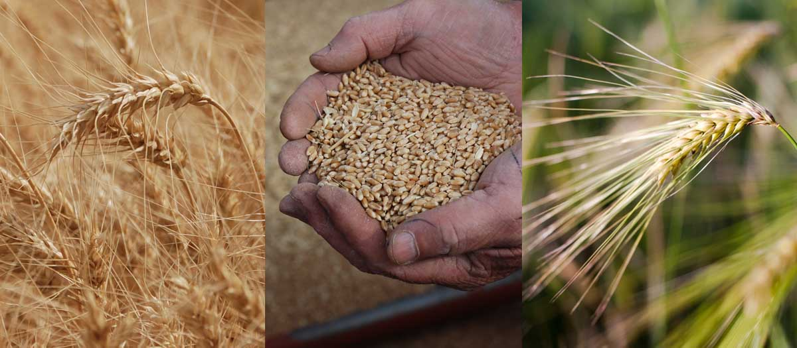

---

---

<!-- { width=100% alt="image of wheat awns at harvest, image of two cupped hands holding wheat kernels, image of a single wheat awn" style="display: block; margin: 0 auto" } -->

# Welcome {.unnumbered}

The  is a "one-stop shop" where Idaho wheat producers can access the latest research results and production recommendations from wheat researchers in Idaho and surrounding region. 

The  is produced by the University of Idaho with support from the Idaho Wheat Commission. Contributors include Idaho and regional researchers.
    

## How to use this guide {.unnumbered}

Browse topics in the sidebar, or use the search bar in the top right corner of this page. Save, download and print articles, bulletins, and guide sections individually, or [download the full Wheat Production Guide]() as a printable booklet. 

::: {.callout-note}
Our site is still under active development, and the downloadable Wheat Production Guide is not yet available. Please check back soon!
:::

## Are we missing something? {.unnumbered}  
[Contact us](mailto:egalvin@uidaho.edu) with requests for articles, topics and resources you would like to see included in this guide. 

